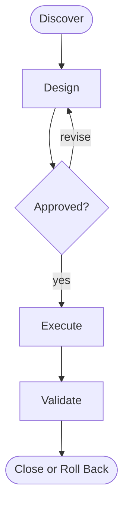

# Flow {{WORKFLOW_NAME}}

- **Intent:** [one sentence]
- **Prerequisites:** [verified requirements or `[ASSUMPTION]`]
- **Keyword chain:** `DISCOVER -> DESIGN -> APPROVE -> EXECUTE -> VALIDATE -> CLOSE`
- **Artifacts:** [exact package-local, repository, tracker, or handoff outputs]
- **Approval gates:**
  1. [gate, decision owner, pass condition]
- **Validation:** [existing deterministic commands or missing contract to create]
- **Risk:** low / medium / high, with reason
- **Rollback:** [concrete recovery action and preserved state]
- **Repository evidence:** [at least two paths, commands, or verified absences]
- **Assumptions:** [labeled list or `none`]

