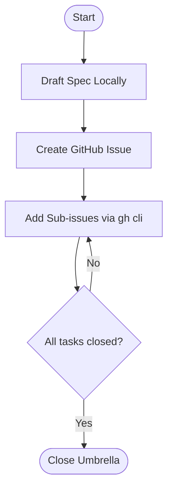

# Output Quality Reference

Quality markers, anti-patterns, scoring rubric, and good vs. bad examples
for each phase of `analyzing-workflow-patterns`.

---

## Phase 0 — Material Pre-processing

**Good:**
```
- Source: https://example.com/workflow-spec (fetched, 4200 words)
- Material type: issue-decomposition
- Primary goal: Translate multi-week initiatives into GitHub sub-issue graphs
- Core entities: umbrella issue, epic, sub-issue, phase gate, handoff file
- Core verbs: decompose, link, validate, block, roll-up, close
```

**Bad:**
```
- Source: user provided
- Material type: workflow
- Primary goal: manage tasks
```

The bad example is useless for Phase 4 keyword construction. Entities and
verbs must come from the actual material vocabulary.

---

## Phase 1 — Extraction Table

**Good cell: "How to reuse safely"**
> "Deploy as the standard structural skeleton for any large feature epic.
> Replace phase names (Foundation/Parallel/Release) with domain terms that
> match your team's language."

**Bad cell: "How to reuse safely"**
> "Use this pattern in your repo."

**Good cell: "What not to copy blindly"**
> "The specific 5 sub-tasks count per epic, exact label names like `phase-8`
> or `knowrag`, and command strings like `w7 verify @lab/ll-KNOWRAG`."

**Bad cell: "What not to copy blindly"**
> "Example-specific details."

**Template variable column** — must map to actual `{{VARIABLE}}` tokens
from `template-variables.md`. Never leave this column empty or write "N/A".

---

## Phase 2 — Hungarian Explanation

**Minimum depth per section:**

| Section | Minimum |
|---------|---------|
| 1. Mit ír le... | 2 substantial paragraphs |
| 2. Mi az újrahasználható... | 2 paragraphs with named entities |
| 3. Mi az, amit nem szabad... | 1 paragraph with concrete examples |
| 4. Hogyan kell repo-specifikusan... | 2 paragraphs referencing actual repo findings |
| 5. Milyen approval / validation... | 2 paragraphs, each gate named explicitly |

**Good (Section 2 extract):**
> "A minta magja a háromszintű hierarchikus felépítés és a fázis alapú
> végrehajtási sorrend. Az 1. szint az Umbrella (Scope Owner), amely egyetlen
> issue formájában írja le a teljes kontextust..."

**Bad (Section 2 extract):**
> "A workflow egy jó struktúrát ír le a fejlesztési folyamatokhoz."

---

## Phase 4 — Keyword Flows

**Naming convention checklist:**
- [ ] ALL_CAPS_WITH_UNDERSCORES
- [ ] Verb-first or Noun_Verb: `UMBRELLA_SPEC_DRAFT`, not `DRAFT_STUFF`
- [ ] Gate steps end with `_GATE`, `_CHECK`, `_SIGN_OFF`
- [ ] Artifact creation ends with `_CREATE`, `_SPAWN`, `_GEN`
- [ ] Validation ends with `_LINT`, `_VERIFY`, `_VALIDATE`
- [ ] Domain vocabulary from Phase 0 entities and verbs

**Good CANONICAL_FLOW:**
```
INITIATIVE_INGEST -> UMBRELLA_SPEC_DRAFT -> ARCHITECT_SIGN_OFF ->
UMBRELLA_GH_CREATE -> EPIC_PHASE_PARTITION -> GRAPHQL_SUBISSUE_LINKING ->
SUBTASK_CONVENTIONAL_DECOMPOSE -> STRUCTURAL_LINT -> PHASE_TRANSITION_GATE ->
HANDOFF_GEN -> ROLLUP_VALIDATE -> UMBRELLA_CLOSE
```

**Bad CANONICAL_FLOW:**
```
START -> ANALYZE_STUFF -> REVIEW -> CREATE_THINGS -> DO_WORK -> CLOSE
```

**Flow differentiation requirement:**
LIGHTWEIGHT must use 40–60% of the keywords in CANONICAL.
STANDARD uses 60–75%. STRICT uses 100% plus adds gates between every phase.
Never produce four flows that are just the same list at different lengths.

---

## Phase 5 — Repository Reality Check

**Good "Missing Workflow Primitives" section:**
> "No automated bash script exists to invoke the GraphQL or REST sub_issues
> endpoint mapping. No pre-commit hooks or structural linter profiles are
> registered. `.claude/rules/` directory does not exist — conventional commit
> title validation cannot run without creating it."

**Bad:**
> "Some things are missing that the workflow requires."

**Clean canvas declaration (use exactly when appropriate):**
```
STATUS: Clean canvas — no structural config files detected.
This means all recommended flows must CREATE their required primitives
from scratch. No adaptation of existing patterns is possible.
```

---

## Phase 8 — Flow Definitions

**Flow name format:**
```
Flow N — CATEGORY: Descriptive Name
```
Example: `Flow 2 — STANDARD: GitHub CLI Native Decomposition`

**"Why this flow fits" quality:**
Must reference at least two concrete findings from Phase 5.

**Good:**
> "Your repository is currently a clean canvas with no validation commands
> configured. Flow 2 uses only `gh api` calls and requires no Makefile or
> CI runner, which matches the current zero-config state. The lack of
> `.claude/rules/` means the conventional commit validation described in
> Phase 7 can be added incrementally rather than as a prerequisite."

**Bad:**
> "This flow is a good fit because it is not too complex."

**Mermaid diagram requirements:**
- Minimum 5 nodes
- STRICT and AGENTIC must include `{}` decision diamonds
- Labels must be readable — not cryptic abbreviations
- Arrows must accurately reflect the flow keyword sequence

**Example of a valid LIGHTWEIGHT diagram:**


---

## Phase 9 — Scoring Rubric

### Repo fit (1–10)
- 10: Requires zero new files; maps to existing conventions perfectly
- 7–9: Requires 1–2 new files that slot cleanly into existing structure
- 4–6: Requires new directories or conventions that don't exist yet
- 1–3: Requires significant rework of existing patterns or tooling

### Safety (1–10)
- 10: Multiple independent gates; accidental damage is nearly impossible
- 7–9: At least one approval gate before destructive/mutating operations
- 4–6: Some gates but could be bypassed accidentally
- 1–3: No gates; one wrong command causes damage

### Effort (1–10)
- 10: Done in under 30 minutes; 1–2 files
- 7–9: Done in under a day; 3–5 files or commands
- 4–6: 1–3 days; moderate new infrastructure
- 1–3: Multi-day setup; CI/CD overhaul required

### Automation potential (1–10)
- 10: Entire flow can be automated; human only approves
- 7–9: Mostly automated; 1–2 manual steps
- 4–6: Mixed; roughly half automated
- 1–3: Mostly manual; Claude assists but does not drive

### Maintainability (1–10)
- 10: Self-documenting; trivial to update when repo evolves
- 7–9: Clear update path; changes contained in 1–2 files
- 4–6: Updates require touching multiple locations
- 1–3: Brittle; small repo changes break the flow

### Reversibility (1–10)
- 10: Fully undone with one command; no side effects
- 7–9: Undone in 2–3 steps; known blast radius
- 4–6: Reversible but requires manual cleanup
- 1–3: Difficult to reverse; wide or opaque blast radius

---

## Possible Additions — Quality Bar

Each Possible Addition must be a **named, concrete deliverable** with a
one-sentence description of what it does.

**Good:**
> "A. Pre-close GraphQL check script: a standalone `check_rollup.sh` that
> queries whether all child sub-issues are CLOSED before allowing an
> umbrella issue to be marked done."

> "B. Conventional commit title linter: a `validate_titles.py` script that
> reads issue titles from stdin and exits non-zero if any violate the
> `type(scope): description` format."

**Bad:**
> "A. A helper script to make things easier."
> "B. Automation improvements."

---

## Anti-Patterns (never do these)

| Anti-pattern | Why it fails |
|---|---|
| Starting Phase 8 without Phase 5 | Recommendations have no grounding; scores are invented |
| Generic keyword names (STEP_A, PROCESS_B) | Phase 4 is useless for template reuse |
| Copying source example issue numbers or label names | Corrupts repo-specific customization |
| Skipping "What not to copy blindly" column | Engineers copy everything and break conventions |
| Single-sentence Hungarian sections | Phase 2 becomes useless for team alignment |
| Decorative Mermaid diagrams that don't match keywords | Inconsistency between Phase 4 and Phase 8 |
| Writing Phase 10 and then continuing with file writes | Violates the core hard-stop rule |
| Vague Possible Additions | Team cannot act on them; wastes the iteration section |
| Recommending STRICT flow for a clean canvas repo | Mismatch; STRICT requires existing primitives |
