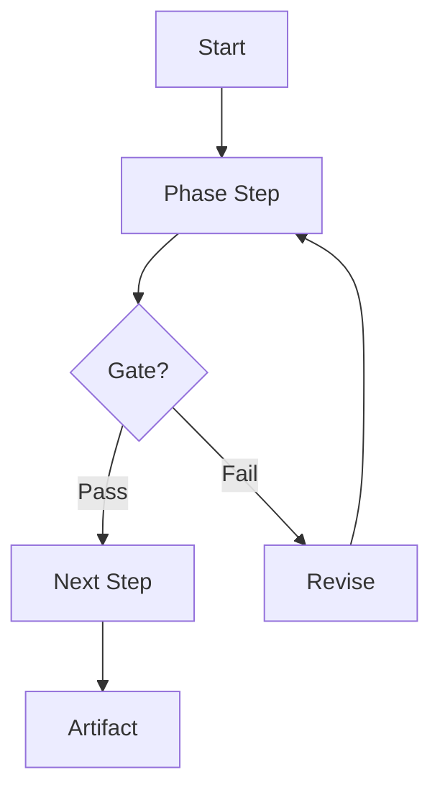

# Full 11-Phase Protocol

Reference for `analyzing-workflow-patterns`. Contains the exact output
templates, column definitions, quality minimums, and format requirements.

---

## Phase 0 — Material Pre-processing

**Goal:** Before any analysis, establish what was given and what it is.
This phase runs silently but its conclusions gate everything that follows.

**Steps:**

1. If a URL is in the opening message → fetch it immediately. Do not start
   Phase 1 until the content is available.
2. Identify the **material type** from this list:
   - `issue-decomposition` — hierarchical issue/epic/sub-task spec
   - `ci-cd-flow` — pipeline, build, test, deploy workflow
   - `agentic-workflow` — Claude Code / LLM agent orchestration design
   - `planning-discipline` — sprint planning, V1/V2, backlog management
   - `release-gate` — versioning, tagging, dogfooding, smoke test flow
   - `doc-sync` — documentation generation or consistency workflow
   - `github-projects` — kanban/roadmap board automation design
   - `custom` — describe in one sentence if none of the above fit
3. Extract and list the **core entities** (nouns) and **core verbs** found
   in the material. These become the building blocks for Phase 4 keywords.
4. State the **primary goal** in one sentence.

**Required output:**

```
## Material Pre-processing

- **Source:** [filename / URL / pasted text]
- **Material type:** [type from list above]
- **Primary goal:** [one sentence]
- **Core entities:** [comma-separated list]
- **Core verbs:** [comma-separated list]
- **Proceeding to Phase 1.**
```

---

## Phase 1 — Deep Workflow Material Analysis

**Goal:** Extract everything reusable and everything that must NOT be copied.

Extract the following from the workflow material:
- Main purpose and primary goal
- Core entities (objects, roles, artifacts, states)
- Lifecycle sequence (ordered steps / transitions)
- Hard rules and non-negotiable constraints
- Approval gates (human review checkpoints)
- Validation gates (automated correctness checks)
- Scoring rubrics or acceptance criteria
- Artifacts produced (files, issues, reports, tags)
- Explicit out-of-scope items
- Reusable template structure (the skeleton that survives context change)
- Example-specific details that must NOT be copied (names, IDs, labels)

**Required output table — exactly 7 rows:**

| Category | Extracted from current material | How to reuse safely | What not to copy blindly | Template variable |
|---|---|---|---|---|
| Reusable Pattern | | | | |
| Example-Specific Details | | | | |
| Template Variables | | | | |
| Hard Rules | | | | |
| Approval Gates | | | | |
| Validation Gates | | | | |
| Output Artifacts | | | | |

**Cell depth requirements:**
- "Extracted from current material" → 1–3 concrete sentences; no vague summaries
- "How to reuse safely" → actionable instruction (e.g. "Deploy as the structural
  skeleton for any large feature epic")
- "What not to copy blindly" → concrete examples of what breaks if copied
  (e.g. "The exact 5 sub-tasks count per epic")
- "Template variable" → map to a real `{{VARIABLE}}` from template-variables.md

See `../assets/phase1-extraction.md` for a copyable starter table.

---

## Phase 2 — Hungarian Explanation

**Goal:** Explain the extracted workflow in Hungarian so the team can evaluate
it before deciding to integrate. Practical, not academic.

Use this exact section structure:

```markdown
# Magyar magyarázat

## 1. Mit ír le az aktuális workflow-anyag?
[Min. 2 paragraphs. What system does the material describe?
What problem does it solve? What is the scale?]

## 2. Mi az újrahasználható minta?
[Min. 2 paragraphs. What is the structural skeleton that survives
any domain change? Describe entities, phases, and transition rules.]

## 3. Mi az, amit nem szabad fixen átvenni?
[Min. 1 paragraph. Concrete examples: names, numbers, paths, label names,
command strings that are specific to the source example.]

## 4. Hogyan kell repo-specifikusan alkalmazni?
[Min. 2 paragraphs. How would this work in the current repo using its
actual tools, branch conventions, and CI setup?]

## 5. Milyen approval / validation / handoff logika van benne?
[Min. 2 paragraphs. Describe each gate: where it occurs, who/what triggers
it, what happens if it fails. Describe the handoff artifact format.]
```

**Language rules:**
- Do NOT translate: `branch`, `PR`, `SKILL.md`, `CLAUDE.md`, `commit`,
  `sub-issue`, `epic`, `.github/`, `gh api`, `GraphQL`, `REST`
- Use technical English terms as-is; write explanation in Hungarian

---

## Phase 3 — Hungarian Examples

**Goal:** Two concrete placeholder-based examples that make the pattern
tangible. Do NOT use real issue numbers, project names, or labels from
historical sessions.

**Example 1 — Small feature:**
- A self-contained change affecting 1–2 components
- Show Umbrella → Epic → Sub-issue breakdown (or equivalent hierarchy)
- Write title and acceptance criteria in English; narrative in Hungarian
- Use placeholder names: `<feature-X>`, `<service-Y>`, `<component-Z>`
- Minimum: 1 umbrella, 2 epics, 2 sub-issues per epic

**Example 2 — Larger repo workflow:**
- A multi-team, multi-phase initiative (3+ epics, parallel tracks)
- Show at least one phase dependency (Epic B blocks until Epic A closes)
- Minimum: 1 umbrella, 3 epics, 2 sub-issues each
- Include at least one Release Gate epic

Both examples written in Hungarian for narrative; issue/task titles in English.

---

## Phase 4 — English Keyword Flows

**Goal:** Express the workflow as exact keyword chains usable as reusable
templates. Adapt to the specific logic of the current material.

**Keyword naming convention (mandatory):**
- ALL CAPS, underscores only: `UMBRELLA_SPEC_DRAFT`, `GRAPHQL_ROLLUP_CHECK`
- Prefer VERB_NOUN or VERB_NOUN_QUALIFIER format
- Use domain verbs from the material (e.g. INGEST, DECOMPOSE, VALIDATE,
  GATE, ARCHIVE, ROLLUP) not generic ones (STEP, PROCESS, DO)
- Gate and checkpoint steps: suffix with `_GATE`, `_CHECK`, `_SIGN_OFF`
- Artifact creation steps: suffix with `_CREATE`, `_SPAWN`, `_GEN`
- Validation steps: suffix with `_LINT`, `_VERIFY`, `_VALIDATE`

**Required output — all four variants:**

```
CANONICAL_FLOW   = [8–12 steps, all gates included, full happy path]
LIGHTWEIGHT_FLOW = [4–6 steps, single gate, minimal ceremony]  
STANDARD_FLOW    = [6–9 steps, 2 gates, reuses existing repo CI]
STRICT_FLOW      = [10–14 steps, every phase gated, audit artifact at end]
```

Each flow must differ meaningfully — not just shorter/longer versions of the
same list. STRICT_FLOW must include `AUDIT_SIGN_OFF` or equivalent terminal
gate. CANONICAL_FLOW must be a valid superset of STANDARD_FLOW.

---

## Phase 5 — Repository Reality Check

**Goal:** Inspect the actual repo before recommending anything. Evidence over
assumptions.

**Inspection commands to run:**

```bash
# Config files
ls -la .claude/ 2>/dev/null || echo "ABSENT: .claude/"
ls -la .github/ 2>/dev/null || echo "ABSENT: .github/"
cat CLAUDE.md 2>/dev/null || echo "ABSENT: CLAUDE.md"
cat AGENTS.md 2>/dev/null || echo "ABSENT: AGENTS.md"

# Build / validation
cat package.json 2>/dev/null | python3 -m json.tool 2>/dev/null | grep -A20 '"scripts"'
cat Makefile 2>/dev/null | grep -E "^[a-z][a-z-]+:" | head -20
cat Taskfile.yml 2>/dev/null | grep -E "^  [a-z]" | head -20

# Git conventions
git log --oneline -10 2>/dev/null
git branch -a 2>/dev/null | head -20

# Issue/PR templates
ls .github/ISSUE_TEMPLATE/ 2>/dev/null
ls .github/workflows/ 2>/dev/null
```

**Clean canvas rule:** if most paths are absent, declare:
```
STATUS: Clean canvas — no structural config detected.
This means all recommended flows will need to CREATE their
required files from scratch, not adapt existing ones.
```

**Required output sections:**

```markdown
# Repository Reality Check

## `.claude` Analysis
[What exists; what is absent; conventions found in CLAUDE.md/commands/]

## `.github` Analysis
[Issue templates, PR templates, Actions workflows, label definitions]

## Existing Planning Conventions
[Markdown plans, .agents/plans/, HANDOFF.md format, CLAUDE.md planning rules]

## Existing Issue / PR Conventions
[Naming patterns, required fields, review rules, commit format]

## Existing Validation Commands
[Test commands, lint commands, CI checks — with exact command strings]

## Existing Handoff Conventions
[HANDOFF.md structure, .handoffs/ layout, agent handoff patterns]

## Missing Workflow Primitives
[What the workflow material requires that does not yet exist in this repo]

## Risks If Added Incorrectly
[What could break or conflict — specific, not generic]
```

---

## Phase 6 — Fit Analysis

**Goal:** Compare the extracted workflow pattern against the repo's actual
state. Surface gaps, conflicts, and the minimum safe integration path.

```markdown
# Fit Analysis

## What Fits Directly
[Parts mapping 1:1 to existing repo conventions; no new files needed]

## What Needs Adaptation
[Parts requiring modification; reference specific existing files/patterns]

## What Should Be Avoided
[Example-specific elements that would conflict with existing patterns]

## Required Template Variables For This Repo
[List each {{VARIABLE}} that must be resolved, with resolved value if known]

## Minimum Safe Integration Path
[The smallest change that adds real value without breaking existing flows.
One concrete action: create one file, run one command, add one template.]
```

---

## Phase 7 — Brainstorm

**Goal:** Explore integration options openly before locking into a flow.
Use sub-headings. Cover all of these, minimum one paragraph each:

- How ambiguous requests from developers should be handled by the workflow
- How planning artifacts should be structured before any GitHub/file writes
- How `.claude/` should encode workflow behavior (commands, CLAUDE.md sections)
- How `.github/` should support state tracking (templates, Actions, labels)
- Whether GitHub Issues, Markdown plans, or both should be used — and why
- What validation commands should gate phase transitions
- What approval gate design fits the team's actual review culture
- What rollback path exists at each destructive step
- What handoff artifact format (HANDOFF.md, `.handoffs/`, GitHub comment)
  makes most sense given Phase 5 findings

Write this as exploration. Raise tradeoffs. Do not commit to a single flow.

---

## Phase 8 — Five Recommended Repo-Specific Flows

**Goal:** Exactly 5 flows, one per category, all grounded in Phase 5 findings.

For each flow use this exact structure:

```markdown
## Flow N — [Category]: [Name]

- **Best for:** [specific use case and team context; one sentence]
- **Exact flow keywords:** `KEYWORD_A -> KEYWORD_B -> GATE -> KEYWORD_C -> ARTIFACT`
- **Required repo files/conventions:**
  - `path/to/file` — [why needed]
- **`.claude` integration:** [what to add/modify; describe, don't create]
- **`.github` integration:** [what to add/modify; describe, don't create]
- **Template variables used:** `{{VAR_1}}`, `{{VAR_2}}`
- **Artifacts created:** [list: files, issues, PRs, tags, plans]
- **Approval gates:**
  1. [First gate — where, what is reviewed, who approves]
  2. [Second gate if applicable]
- **Validation strategy:** [commands from Phase 5 if found; or what to create]
- **Risk level:** Low / Low-Medium / Medium / Medium-High / High
- **Rollback strategy:** [one concrete sentence; must be actionable]
- **Why this flow fits:** [one paragraph referencing actual Phase 5 findings]
```

Then immediately append a Mermaid diagram:

````

````

**Mermaid quality requirements:**
- Minimum 5 nodes
- STRICT and AGENTIC flows must include at least one decision diamond `{}`
- Use rectangle `[]` for actions, diamond `{}` for gates, rounded `()` for
  start/end if desired
- Node labels must match the Phase 4 keyword vocabulary (SCREAMING_SNAKE not
  required in labels, but meaning must be consistent)
- Diagrams must accurately reflect the flow keywords — no decorative diagrams

---

## Phase 9 — Fit Matrix + Default Recommendation

**Fit matrix table (required):**

```markdown
# Fit Matrix

| Flow | Repo fit | Safety | Effort | Automation potential | Maintainability | Reversibility | Recommendation |
|---|---:|---:|---:|---:|---:|---:|---|
| Flow 1 — [Name] | /10 | /10 | /10 | /10 | /10 | /10 | [label] |
| Flow 2 — [Name] | /10 | /10 | /10 | /10 | /10 | /10 | [label] |
| Flow 3 — [Name] | /10 | /10 | /10 | /10 | /10 | /10 | [label] |
| Flow 4 — [Name] | /10 | /10 | /10 | /10 | /10 | /10 | [label] |
| Flow 5 — [Name] | /10 | /10 | /10 | /10 | /10 | /10 | [label] |
```

Scoring rules → `references/output-quality.md#scoring-rubric`.

**Combination allowance:** The default recommendation MAY suggest pairing
two flows (e.g., "Flow 2 as the base paired with Flow 4 orchestration style")
when that is genuinely better than a single flow. State the combination
explicitly and explain what is taken from each.

**Default recommendation block (required):**

```markdown
# Default Recommendation

## Recommended Flow
Flow N — [Name] [optionally: paired with Flow M elements]

## Why This One
[2–3 sentences grounded in Phase 5 findings. Reference actual paths,
commands, or conventions discovered. No generic language.]

## What It Would Create
- [Concrete file or config 1]
- [Concrete file or config 2]
- [Issue/PR/label if applicable]

## What It Would Not Touch Yet
- [Explicit list of repo areas left unchanged in this first pass]

## First Safe Implementation Step After Approval
[Single, concrete, reversible action. Must name the exact file or command.]
```

---

## Phase 10 — Decision Checkpoint

**Hard stop.** Output this block exactly, then stop:

```markdown
# Decision Needed

Choose one option:

- `Flow 1 — [Name]`
- `Flow 2 — [Name]`
- `Flow 3 — [Name]`
- `Flow 4 — [Name]`
- `Flow 5 — [Name]`
- `Combine flows: [describe]`
- `Revise with additions: [describe]`

Ready for your review. I will not modify the repository until you choose
or approve a flow.
```

**After this block: STOP. Do not write any file, branch, issue, PR, or
config until the user responds with an explicit choice.**

---

## Mandatory Iteration Section (every response)

Append after Phase 10. Content must be **fresh and specific** each time.

```markdown
# Possible Additions

A. [Specific tool, script, or hook — name it and describe what it does]
B. [Specific tool, script, or hook]
C. [Specific tool, script, or hook]
D. [Specific tool, script, or hook]
E. [Specific tool, script, or hook]

# Questions

1. [Targeted question that would change a flow score or recommendation]
2. [Question about a specific gate, command, or approval behavior]
3. [Question that would resolve an UNRESOLVED template variable]
```

Good Possible Addition: "A pre-commit hook that validates issue titles match
`type(scope): description` format before sub-issues are created."  
Bad Possible Addition: "A script to help with automation." (too vague)
